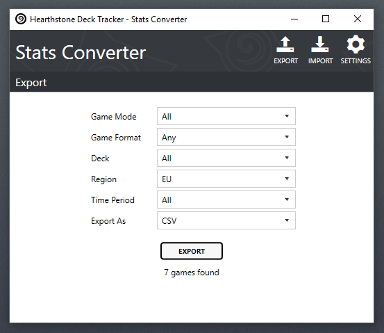
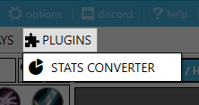
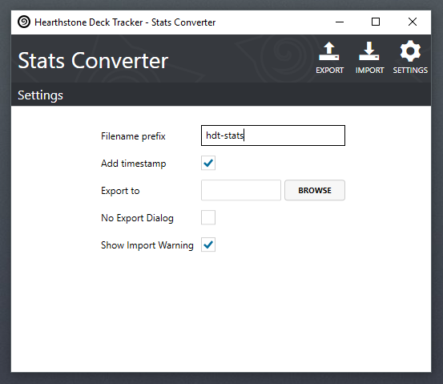

## Stats Converter

A plugin to import and export game statistics from [Hearthstone Deck Tracker](https://github.com/HearthSim/Hearthstone-Deck-Tracker).

---

## Install
- Download the [latest release](https://github.com/andburn/hdt-plugin-statsconverter/releases/latest) (*not the source code*)
- Unzip the contents into you Hearthstone Deck Tracker's plugins folder (or drag-and-drop onto the plugin menu)
- Enable the plugin in HDT's settings
- Use the plugin [settings](#settings) to customize it's behaviour

## Features

Allows exporting and importing game statistics from [Hearthstone Deck Tracker](https://github.com/HearthSim/Hearthstone-Deck-Tracker). Two formats are currently supported CSV (*Comma Separated Values*) and Excel. Exporting enables players to analyse their statistics outside of HDT. Importing allows new games to be added and existing games edited, see [note](#importing) about importing below.

## Usage
The plugins menu opens the main converter window. Select one of the import, export or settings buttons as required.

### Settings
The settings page allows you to change how the plugin behaves.

- **Filename prefix**, the name to give any exported stats files.
- **Add timestamp**, add the date and time to the filename of exported stats.
- **Export to**, set the default export directory.
- **No Export Dialog**, do not show a file save dialog when exporting, use the directory specified in '*Export to*' (*Desktop* by default).
- **Show Import Warning**, shows the warning message on the import page.

## Importing
Extra care must be taken when importing statistics, you should always check that the importing process has worked as expected by inspecting the stats in HDT. If you need to revert an import restore the most recent backup found in the HDT options.

Importing is mainly intended for editing existing statistics using data previously exported by this plugin. Creating statistics files manually and importing them, for adding new games for example, should work but care should be taken that the format is correct.

## License
The plugin is licensed under the terms of the MIT license. The full license text is available in the LICENSE file.

## Attribution
This plugin uses [IcoMoon](https://icomoon.io/) free font icons licensed under [CC BY 4.0](https://creativecommons.org/licenses/by/4.0/)
